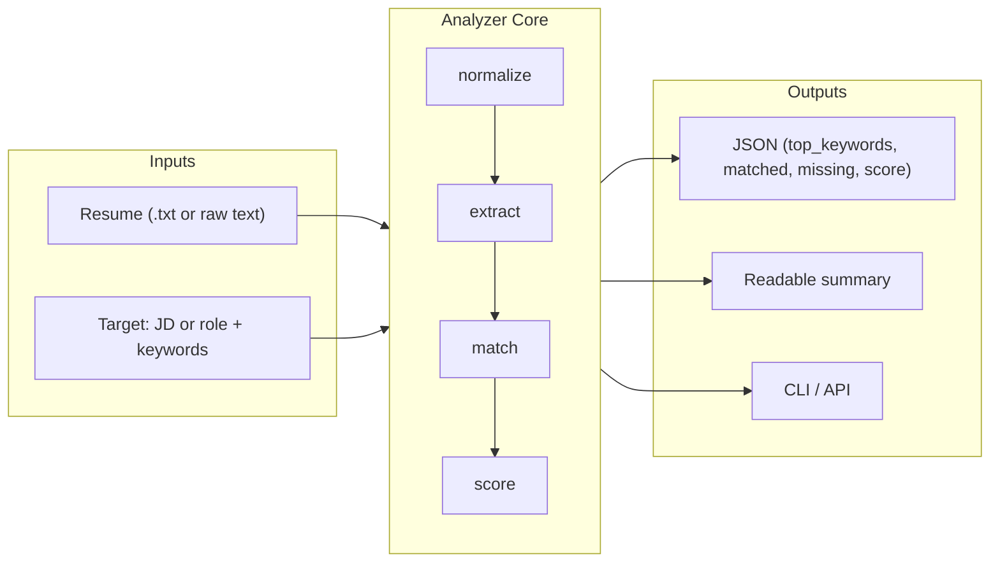

# Resume Analyzer Agent

Lightweight tool that evaluates a plain-text resume against a target role by extracting keywords and producing an actionable, human-readable assessment. **Not an ATS clone** — a fast signal generator with deterministic, explainable scoring.

**Deadline:** EOD Monday, February 2, 2026.

---

## Features

- **Inputs:** Resume text (`.txt` or raw), job description text **or** role title + keyword list
- **Outputs:** JSON (top keywords, matched, missing, score, confidence notes) + readable summary
- **Scoring:** Simple, deterministic, explainable (see [Scoring logic](#scoring-logic))
- **Edge handling:** C++, Node.js, .NET, SQL vs NoSQL, Python/Python3, JS/JavaScript (synonyms)

---

## Architecture



Pipeline: **normalize** (tokenize, special tokens e.g. C++/.NET) → **extract** (keywords, ranking) → **match** (synonym-aware matched/missing) → **score** (deterministic 0–100). Single core; CLI and API both call the same analyzer.

---

## Quick start

### Install and run locally

```bash
# Clone and install (Python 3.11+)
cd resume-agent
pip install -e .

# CLI: analyze resume vs job description
resume-analyzer analyze --resume examples/sample_resume.txt --job examples/sample_jd.txt

# CLI: resume vs role + keywords
resume-analyzer analyze --resume examples/sample_resume.txt --role "Backend Engineer" --keywords "Python,API,PostgreSQL,Docker"

# Output: JSON + summary (default). Use --format json or --format summary for one only.
# Optional: --output result.json to write to file
```

### API (local)

```bash
uvicorn api.main:app --reload
# POST http://localhost:8000/analyze
# GET  http://localhost:8000/docs
```

**Request body (JSON):**

```json
{
  "resume_text": "Plain text resume...",
  "job_description": "Full job description text...",
  "role_title": "Optional role title",
  "keywords": ["python", "api", "sql"]
}
```

Provide at least one of: `job_description`, or `role_title`/`keywords`.

---

## Example output

**CLI (summary):**

```
=== Resume Analysis Summary ===

Overall score: 85/100

Top keywords (resume):
  1. python
  2. api
  3. sql
  ...

Matched (12): api, docker, javascript, node.js, postgresql, python, rest, sql, ...

Missing (2): gcp, kubernetes

Confidence notes:
  • Strong overlap with target keywords.
```

**JSON (excerpt):**

```json
{
  "top_keywords": [{"term": "python", "rank": 1}, ...],
  "matched_keywords": ["api", "docker", "python", "rest", "sql", ...],
  "missing_keywords": ["gcp", "kubernetes"],
  "confidence_notes": ["Strong overlap with target keywords."],
  "overall_score": 85.0,
  "score_breakdown": {
    "matched_count": 12,
    "target_count": 14,
    "formula": "score = (matched_count / max(1, target_count)) * 100, capped at 100"
  }
}
```

---

## Scoring logic

- **Formula:** `score = (matched_count / max(1, target_keyword_count)) * 100`, capped at 100.
- **Interpretation:** Percentage of target keywords that appear in the resume (after normalization and synonym expansion).
- **Why this formula:** Keyword overlap (with synonym expansion) keeps the score fully explainable: it’s the share of target keywords present in the resume, with no black box. Same inputs always yield the same score.
- **Deterministic:** Same inputs → same score. No ML; keyword-based only.
- **Confidence notes:** Added when score is very low, very high, or when few target keywords were provided.

### Edge cases (boundary handling)

Explicit handling so tech terms are treated correctly:

| Case | Behavior |
|------|----------|
| **C++**, **Node.js**, **.NET** | Kept as single tokens (not split on punctuation). |
| **SQL vs NoSQL** | Treated as distinct; not synonyms. |
| **Python / Python 3** | Synonyms; “Python 3” in JD matches “Python” in resume. |
| **JavaScript / JS / Node.js** | Synonyms for matching. |
| **.NET / C#** | Synonyms. |

See `resume_analyzer/normalize.py` (special tokens) and `resume_analyzer/synonyms.py` (curated map).

### Design decisions

- **Keyword overlap, not semantic similarity** — Keeps the score simple and explainable; no embeddings or ML. Tradeoff: “machine learning” in the JD won’t match “ML” in the resume unless we add that synonym.
- **Curated synonym list** — Small, explicit map (Python↔Python3, JS↔JavaScript, etc.) so matching is predictable and easy to extend.
- **Single core, two interfaces** — CLI and API both call the same analyzer; one implementation to test and maintain.

### Limitations

- **Plain text only** — no PDF/Word parsing.
- **Keyword-based** — no semantic similarity or embeddings. This is a fast signal, not a semantic match.
- **Not an ATS** — use as a fast signal, not a hiring gate.
- **English-oriented** — stopwords and tokenization tuned for English.

---

## Tests

```bash
pip install -e ".[dev]"
pytest tests -v
```

Covers: normalization (C++, Node.js, .NET, SQL/NoSQL), synonyms (Python/Python3, JS/JavaScript, .NET/C#), matching, scoring, and end-to-end analyzer.

---

## Deploy

A `Dockerfile` is provided for deployment (e.g. Railway, Render, Fly.io).

### Deploy on Render

1. Go to [render.com](https://render.com) and sign in with **GitHub**.
2. **New** → **Web Service**.
3. Connect your **resume-agent** repo and select it.
4. **Settings:**
   - **Name:** e.g. `resume-analyzer`
   - **Environment:** **Docker** (Render will use the repo’s `Dockerfile`).
   - **Region:** choose one.
   - **Plan:** Free or paid.
5. Click **Create Web Service**. Render builds from the Dockerfile and deploys.
6. Once live, copy your service URL (e.g. `https://resume-analyzer-xxxx.onrender.com`).
   - **Analyze:** `POST https://resume-agent-px2s.onrender.com/analyze`
   - **Docs:** `https://resume-agent-px2s.onrender.com/docs`
   - **Health:** `https://resume-agent-px2s.onrender.com/health`

The app listens on Render’s `PORT`; the Dockerfile is set up to use it.

### Run Docker locally

```bash
docker build -t resume-analyzer .
docker run -p 8000:8000 resume-analyzer
# POST http://localhost:8000/analyze
```

### Testing the deployment

Live URL: **https://resume-agent-px2s.onrender.com**

**Browser (GET):**

- **Root / info:** [https://resume-agent-px2s.onrender.com/](https://resume-agent-px2s.onrender.com/)
- **Health:** [https://resume-agent-px2s.onrender.com/health](https://resume-agent-px2s.onrender.com/health)
- **API docs (Swagger):** [https://resume-agent-px2s.onrender.com/docs](https://resume-agent-px2s.onrender.com/docs) — use “Try it out” on `POST /analyze` to send a request from the browser.

**Terminal — POST /analyze (curl):**

```bash
curl -X POST https://resume-agent-px2s.onrender.com/analyze \
  -H "Content-Type: application/json" \
  -d '{"resume_text": "Python developer with 5 years experience. REST APIs, SQL, Docker.", "job_description": "We need Python, API, and SQL skills."}'
```

**PowerShell (Windows):**

```powershell
$body = '{"resume_text": "Python developer with 5 years experience. REST APIs, SQL, Docker.", "job_description": "We need Python, API, and SQL skills."}'
Invoke-RestMethod -Uri "https://resume-agent-px2s.onrender.com/analyze" -Method Post -Body $body -ContentType "application/json"
```

**Free tier:** On Render’s free plan, the instance spins down after inactivity. The first request after idle can take ~50 seconds; retry if it times out.

---

## Project layout

```
resume-agent/
├── pyproject.toml
├── README.md
├── resume_analyzer/       # core package
│   ├── normalize.py       # tokenization, special tokens (C++, .NET, etc.)
│   ├── synonyms.py        # Python/Python3, JS/Node.js, .NET/C#, etc.
│   ├── extract.py         # keyword extraction and ranking
│   ├── match.py           # matched/missing (synonym-aware)
│   ├── score.py           # deterministic score + confidence notes
│   ├── analyzer.py        # orchestration
│   ├── models.py          # Pydantic I/O + readable summary
│   └── cli.py             # Typer CLI
├── api/
│   └── main.py            # FastAPI POST /analyze
├── tests/
├── examples/
│   ├── sample_resume.txt
│   └── sample_jd.txt
└── Dockerfile
```

---

## Submission

- **Repo:** [your-repo-link]
- **Deployed endpoint:** `POST https://resume-agent-px2s.onrender.com/analyze`
- **Run locally:** `pip install -e .` then `resume-analyzer analyze -r examples/sample_resume.txt -j examples/sample_jd.txt`

